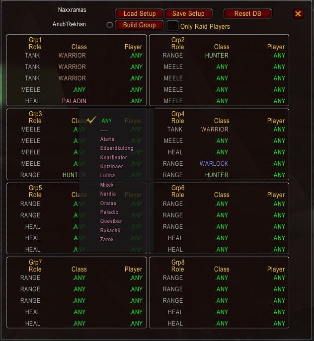
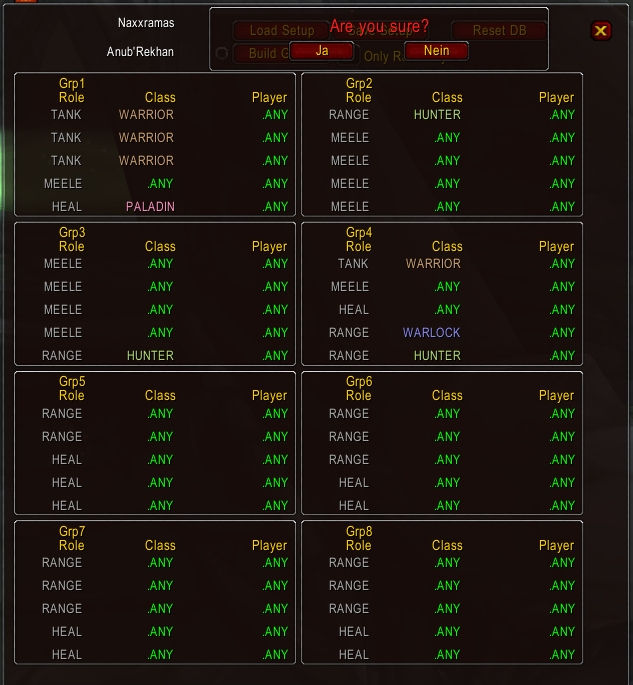

# RaidSetup
 

Datenbank für export (nach Loggout): "\WTF\Account\\%LOGIN%\SavedVariables\RaidSetup.lua"

### Funktionen:

- Bauen des Raids nach angezeigtem Schema
- Auto Build - aktualisiert die Raidaufstellung bei: Hinzufügen/Entfernen eines Spielers, Laden eines Setups, Ändern der Aufstellung
- Slotbelegung nach den Filtern: Rolle->Klasse->Spieler. (Alle Optional und einzeln nutzbar)
- Sperren von Slots (keine Beachtung beim Bauen)
- Laden und Speichern der Setups
- Samelt die Spieler aus eurem Raid in einer Datenbank
- DB resetten (Templates werden wiederhergestellt, alle Einstellungen werden gelöscht)
- Auswahlmöglichkeiten und Gestaltung siehe [Screenshots](./Screenshots)

### Bedienung:

/RaidSetup - Aufrufen und schließen der UI (Öffnet zugleich den Ingame RaidFrame)

Die Spalten "Role", "Class" und "Player" sind Filter, durch die entschieden wird welcher Spieler aus eurem Raid für diesen Slot geeignet ist.
Gleichzeitig schränkt jeder Filter die Auswahl zu seiner Rechten ein, um eine bessere Übersicht zu gewährleisten.
Beim Bauen werden entsprechende Spieler für die Slots ausgewählt und dorthin verschoben.

| Role | Class | Player | Bedeutung/Ergebnis |
|------|-------|--------|--------------------|
| MEELE | ANY | ANY | Alle Meeles (Schurke, Krieger, Dudu, Pala und Schamane) |
| ANY | PRIEST | ANY | Alle Priester (Heal und Range) |
| HEAL | PALADIN | ANY | Alle Heal Palas |
| ANY | ANY | Thekk | Das ist mein Slot |

Bitte beachtet, dass die Reihenfolge der Spieler innerhalb der einzelenen Gruppen im Raid nach dem Sortieren anders sein kann als in dem Layout.
Das ist eine Eigenart des Spiels und lässt sich nicht ändern

### Geplante/nicht implementierte Funktionen:

- Eingabefeld bei den Bossen um mehrere eigene Layouts anzulegen
- Weitere Reiter für MT Targets und Heilerzuordnung bezogen auf das Schema (Inkl. setzten der MT Targets über Ora2 und Posten der Heilereinteilung)
- Weiterer Reiter für die Anzeige der Spieler-Datenbank mit Einstellungsmöglichkeiten
- Autoupdate der Spieler-Rollen nach aktueller Skillung (Ora2 vorrausgesetzt)
- Ingame Verteilung der Spieler- und Schema-Datenbanken
- Einbeziehung einer Ersatzbank in das Schema mit automatischem entfernen/einladen der Spieler
- Nach Bauen Whisper an jeden Spieler mit seiner Rolle und Gruppe (Für evtl. Umskillen) (Spamfilter Serverseitig)
